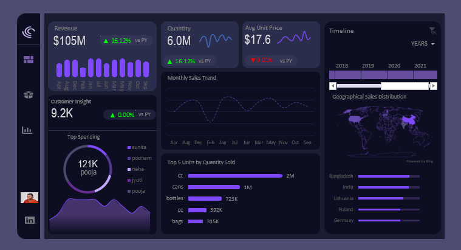
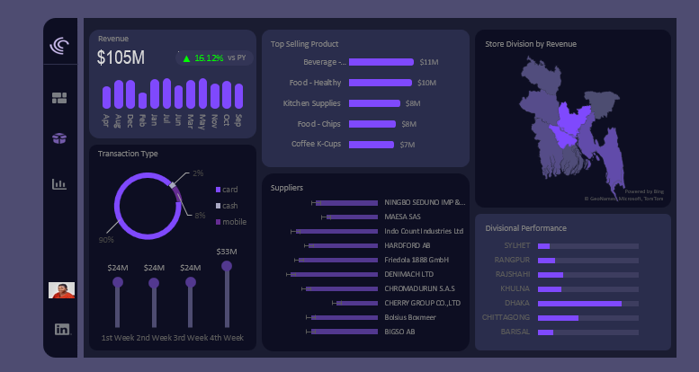

# Retail-Sales-Business-Intelligence-Analysis

##  Project Overview

This project presents a large-scale retail sales analysis performed in **Microsoft Excel**, using **1 million retail transactions** collected across Bangladesh between **2014 and 2021**. The analysis evaluates business performance, customer behavior, and revenue trends across **726 stores**.

An interactive Excel dashboard was developed using Pivot Tables, Pivot Charts, and data visualization techniques to support data-driven decision-making. To extend the analysis beyond the dashboard, **Amazon PartyRock** was used to generate AI-assisted additional business insights and strategic recommendations.

---

##  Problem Statement

Despite operating a large-scale retail network serving **9,191 customers** across **726 stores** in all **7 administrative divisions of Bangladesh**, the organization has experienced minimal revenue growth since 2015.

The business has reached a growth plateau, with both revenue and customer numbers remaining largely unchanged over several years. This project analyzes sales performance, customer behavior, and operational trends to identify actionable opportunities for sustainable revenue growth and improved business performance.

## Objectives

- Analyze sales performance across stores and regions.
- Identify revenue trends and seasonal patterns.
- Evaluate customer purchasing behavior.
- Determine high-performing product categories.
- Provide data-driven recommendations to improve business growth.

---

##  Dataset Summary

The dataset follows a **Star Schema**, an industry-standard data warehousing design consisting of **one central fact table** and **five dimension tables** that provide context about customers, products, stores, time, and payment methods.

### Dataset Structure

| Table | Rows | Purpose |
|--------|------:|---------|
| **fact_table** | 1,000,000 | Core transaction records |
| **customer_dim** | 9,191 | Customer data |
| **item_dim** | 264 | Product catalog |
| **store_dim** | 726 | Store locations |
| **time_dim** | 99,999 | Date and time dimension |
| **trans_dim** | 39 | Payment methods |

###  Key Metrics

- **💰 Total Sales Revenue:** **$105,401,435.75**
- **👥 Active Customers:** **9,191**
- **📦 Product SKUs:** **264**
- **🏪 Operating Stores:** **726**
- **🌍 Geographic Coverage:** **7 divisions, 64 districts, 540 upazilas**
- **📅 Historical Data Span:** **2014–2021 (8 Years)**

---

##  Tools & Skills Demonstrated

### Tools

- Microsoft Excel
- Power Query
- Pivot Tables
- Pivot Charts
- Microsoft PowerPoint (Dashboard Design)
- Amazon PartyRock (AI-Assisted Analysis)

### Skills

- Data Cleaning
- Dashboard Design
- Data Visualization
- Exploratory Data Analysis (EDA)
- Business Analysis
- Business Storytelling

---

##  Dashboard Preview

### Dashboard Page 1

### Dashboard Page 2

---

##  Key Insights

- **Revenue Growth Stagnation:** Revenue remained largely unchanged between 2015 and 2020, indicating that the business has reached a growth plateau under its current operating model.

- **High-Value Products Are Underutilized:** Premium products, such as Coffee K-Cups and Energy Beverages, generate significantly higher average basket values but contribute a relatively small share of total revenue, highlighting an opportunity to increase sales through targeted promotion.

- **Low Price Sensitivity:** Customers consistently purchased approximately six units per transaction regardless of product price, suggesting that strategic pricing adjustments could increase revenue without negatively affecting demand.

- **Limited Customer Growth:** The customer base remained unchanged for seven years, indicating a contract-based B2B business model where sustainable growth depends on acquiring new institutional customers rather than increasing walk-in sales.

- **Geographic Revenue Concentration:** Dhaka generated the highest share of total revenue, making the business vulnerable to operational disruptions within a single region.

- **Untapped Mobile Payment Opportunity:** Mobile payments accounted for a small portion of total revenue despite Bangladesh's growing mobile-first economy, presenting an opportunity to reduce transaction costs and improve customer convenience.

- **Seasonal Sales Trends:** Sales consistently peaked in **May, July, and January**, while **February** recorded the weakest performance, providing valuable insights for inventory planning, staffing, and promotional campaigns.

---

##  Recommendations

Based on the analysis, the following recommendations could help improve business performance and drive sustainable growth.

### Short-Term Actions (0–3 Months)

- Promote premium products to **Silver** and **Gold** customer segments to increase average basket value.
- Resolve missing customer information to improve data quality and reporting accuracy.
- Encourage mobile payment adoption to reduce transaction processing costs.
- Increase the availability and promotion of high-performing product categories, such as **Coffee K-Cups** and **Energy Beverages**, to maximize revenue.

### Medium-Term Actions (3–12 Months)

- Develop a customer acquisition strategy to expand the **B2B customer base** and drive revenue growth.
- Launch targeted premium product promotions during **Q4**, when average order values are highest.
- Diversify the supplier base to improve supply chain resilience and reduce dependency on a few suppliers.
- Address database naming inconsistencies to improve data management and maintainability.

### Long-Term Strategy (12+ Months)

- Evaluate expansion into new markets or regions to create additional revenue streams.
- Explore dynamic pricing or volume-based discount strategies to optimize revenue.
- Introduce a loyalty program for high-value customers to improve customer retention.
- Assess operational efficiency, including operating hours, to identify potential cost-saving opportunities.

---

##  Conclusion

This project demonstrates how **Microsoft Excel** and **AI-assisted business analysis using Amazon PartyRock** can be combined to transform large retail datasets into meaningful business insights. The analysis highlights opportunities to improve revenue growth, customer acquisition, operational efficiency, and strategic decision-making through data-driven recommendations.

---

#  Retail Sales Performance Dashboard

